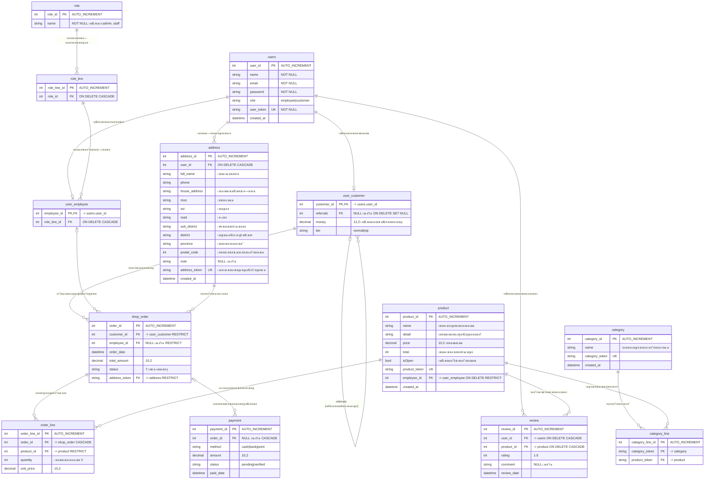
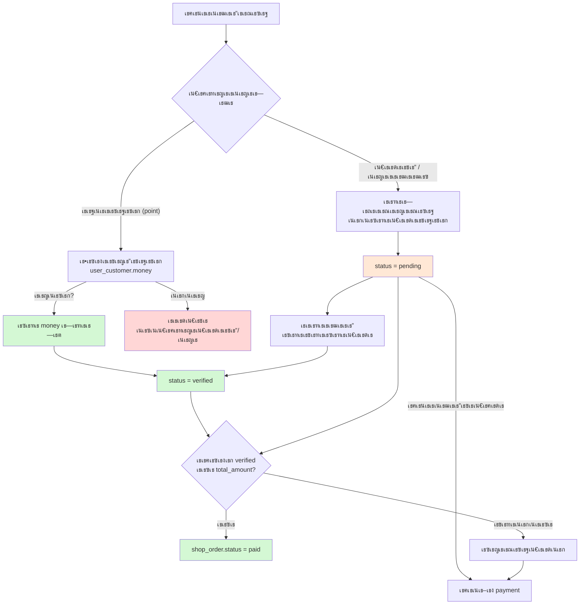

# ER Diagram โ€” Mini Online Shop

> เธชเธฃเน‰เธฒเธ‡เธˆเธฒเธ `schema.sql` เธˆเธฃเธดเธ‡เธ—เธธเธเธ•เธฒเธฃเธฒเธ‡/เธ„เธญเธฅเธฑเธกเธ™เนŒ/เธ„เธตเธขเนŒ เธญเนˆเธฒเธ™เธ—เธดเธจเธ—เธฒเธ‡เธ„เธงเธฒเธกเธชเธฑเธกเธžเธฑเธ™เธ˜เนŒเธˆเธฒเธ **เธ›เธฅเธฒเธขเธ—เธฒเธ‡ (child)** เน„เธ›เธขเธฑเธ‡ **เธ•เน‰เธ™เธ—เธฒเธ‡ (parent)**

## เธเธ•เธดเธเธฒเธเธฒเธฃเธŠเธณเธฃเธฐเน€เธ‡เธดเธ™ (payment.status)

**เธชเธฃเธธเธ›**

| เธŠเนˆเธญเธ‡เธ—เธฒเธ‡ | เธซเธฑเธ `user_customer.money` | `payment.status` | เธ™เธฑเธšเน€เธ›เน‡เธ™เธขเธญเธ”เธŠเธณเธฃเธฐ | เนƒเธ„เธฃเธขเธทเธ™เธขเธฑเธ™ |
|---|---|---|---|---|
| `point` | เธซเธฑเธเธ—เธฑเธ™เธ—เธต | `verified` | เธ™เธฑเธšเธ—เธฑเธ™เธ—เธต | เน„เธกเนˆเธ•เน‰เธญเธ‡ (เธฃเธฐเธšเธšเธ—เธณเนƒเธซเน‰) |
| `cash` | เน„เธกเนˆเธซเธฑเธ | `pending` | เธขเธฑเธ‡เน„เธกเนˆเธ™เธฑเธš | เธžเธ™เธฑเธเธ‡เธฒเธ™ |
| `bank` | เน„เธกเนˆเธซเธฑเธ | `pending` | เธขเธฑเธ‡เน„เธกเนˆเธ™เธฑเธš | เธžเธ™เธฑเธเธ‡เธฒเธ™ |

## เธชเธฑเธเธฅเธฑเธเธฉเธ“เนŒเธ—เธตเนˆเนƒเธŠเน‰

| เธชเธฑเธเธฅเธฑเธเธฉเธ“เนŒ | เธ„เธงเธฒเธกเธซเธกเธฒเธข |
|---|---|
| `PK` | Primary Key |
| `FK` | Foreign Key |
| `UK` | Unique Key |
| `\|\|--o\|` | เธซเธ™เธถเนˆเธ‡ โ†’ เธจเธนเธ™เธขเนŒเธซเธฃเธทเธญเธซเธ™เธถเนˆเธ‡ |
| `\|\|--o{` | เธซเธ™เธถเนˆเธ‡ โ†’ เธซเธฅเธฒเธข |
| `o\|--o{` | เธจเธนเธ™เธขเนŒเธซเธฃเธทเธญเธซเธ™เธถเนˆเธ‡ โ†’ เธซเธฅเธฒเธข (เธ„เธญเธฅเธฑเธกเธ™เนŒ FK เน€เธ›เน‡เธ™ NULL เน„เธ”เน‰) |

## เธˆเธธเธ”เธ—เธตเนˆเธ•เน‰เธญเธ‡เธฃเธฐเธงเธฑเธ‡

1. **Junction table `category_line`** โ€” เธ„เธงเธฒเธกเธชเธฑเธกเธžเธฑเธ™เธ˜เนŒ Many-to-Many เธฃเธฐเธซเธงเนˆเธฒเธ‡ `category` เธเธฑเธš `product` เธ•เน‰เธญเธ‡เธœเนˆเธฒเธ™เธ•เธฒเธฃเธฒเธ‡เธ™เธตเน‰เน€เธชเธกเธญ เธฅเธšเธซเธกเธงเธ”เธซเธกเธนเนˆเนเธฅเน‰เธงเธชเธดเธ™เธ„เน‰เธฒเน„เธกเนˆเธซเธฒเธข เนเธ•เนˆเธซเธกเธงเธ”เธซเธกเธนเน‰เธ—เธตเนˆเธชเธดเธ™เธ„เน‰เธฒเน„เธกเนˆเน„เธ”เน‰เธญเธขเธนเนˆเธˆเธฐเธ–เธนเธเธฅเธš
2. **`user_customer.referrals` เธŠเธตเน‰เธเธฅเธฑเธšเธกเธฒเธ—เธตเนˆเธ•เธฑเธงเน€เธญเธ‡** (self-referencing) โ€” เธฅเธนเธเธ„เน‰เธฒเธ—เธตเนˆเธ–เธนเธเธฅเธšเธˆเธฐเธเธฅเธฒเธขเน€เธ›เน‡เธ™ `NULL` เน„เธกเนˆเธ—เธณเนƒเธซเน‰เธฅเธนเธเธ„เน‰เธฒเธ„เธ™เธญเธทเนˆเธ™เธซเธฒเธข
3. **`shop_order.employee_id` เน€เธ›เน‡เธ™ NULL เน„เธ”เน‰** โ€” เธญเธญเน€เธ”เธญเธฃเนŒเธ—เธตเนˆเธฅเธนเธเธ„เน‰เธฒเธชเธฑเนˆเธ‡เน€เธญเธ‡เธˆเธฐเน„เธกเนˆเธกเธตเธžเธ™เธฑเธเธ‡เธฒเธ™เธœเธนเน‰เธ”เธนเนเธฅ
4. **`payment.order_id` เน€เธ›เน‡เธ™ NULL เน„เธ”เน‰** โ€” เธŠเธณเธฃเธฐเน€เธ‡เธดเธ™เธฅเนˆเธงเธ‡เธซเธ™เน‰เธฒ/เธฃเธฒเธขเธเธฒเธฃเธ—เธตเนˆเธขเธฑเธ‡เน„เธกเนˆเธœเธนเธเธเธฑเธšเธญเธญเน€เธ”เธญเธฃเนŒ
5. **`order_line` เธ„เธทเธญเธฃเธฒเธขเธฅเธฐเน€เธญเธตเธขเธ”เธชเธดเธ™เธ„เน‰เธฒเนƒเธ™เธญเธญเน€เธ”เธญเธฃเนŒ** โ€” เธฅเธšเธญเธญเน€เธ”เธญเธฃเนŒเนเธฅเน‰เธงเธฃเธฒเธขเธเธฒเธฃเธชเธดเธ™เธ„เน‰เธฒเธซเธฒเธขเธ•เธฒเธก (CASCADE) เนเธ•เนˆเธฅเธšเธชเธดเธ™เธ„เน‰เธฒเธ—เธตเนˆเธ–เธนเธเธชเธฑเนˆเธ‡เนเธฅเน‰เธงเน„เธกเนˆเน„เธ”เน‰ (RESTRICT)
6. **`review` เธกเธต UNIQUE (user_id, product_id)** โ€” เธฅเธนเธเธ„เน‰เธฒเธฃเธตเธงเธดเธงเธชเธดเธ™เธ„เน‰เธฒเน€เธ”เธดเธกเน„เธ”เน‰เธ„เธฃเธฑเน‰เธ‡เน€เธ”เธตเธขเธง เธ•เน‰เธญเธ‡เน„เธ›เนเธเน‰เธ‚เธญเธ‡เน€เธ”เธดเธก
7. **`shop_order.total_amount` เธ•เน‰เธญเธ‡เน€เธ—เนˆเธฒเธเธฑเธšเธœเธฅเธฃเธงเธกเนƒเธ™ `order_line`** เน€เธชเธกเธญ โ€” เธ–เน‰เธฒเน„เธกเนˆเน€เธ—เนˆเธฒเธเธฑเธ™เธ‚เน‰เธญเธกเธนเธฅเธˆเธฐเธœเธดเธ” (เนƒเธ™เน‚เธ„เน‰เธ” `db.py` เธ„เธณเธ™เธงเธ“เนƒเธซเน‰เนƒเธซเธกเนˆเธ—เธธเธเธ„เธฃเธฑเน‰เธ‡เธ—เธตเนˆเนเธเน‰เธฃเธฒเธขเธเธฒเธฃเธชเธดเธ™เธ„เน‰เธฒ)
8. **`payment.status` เธเธณเธซเธ™เธ”เธงเนˆเธฒเธญเธญเน€เธ”เธญเธฃเนŒเธ™เธฑเธšเธงเนˆเธฒเธŠเธณเธฃเธฐเนเธฅเน‰เธงเธซเธฃเธทเธญเธขเธฑเธ‡**
   - `point` = เธฅเธนเธเธ„เน‰เธฒเธˆเนˆเธฒเธขเธˆเธฒเธเธขเธญเธ”เน€เธ‡เธดเธ™เธชเธฐเธชเธก โ†’ เธซเธฑเธ `user_customer.money` เธ—เธฑเธ™เธ—เธตเนเธฅเธฐเธ•เธฑเน‰เธ‡เน€เธ›เน‡เธ™ `verified` เธญเธฑเธ•เน‚เธ™เธกเธฑเธ•เธด
   - `cash` / `bank` = เธฅเธนเธเธ„เน‰เธฒเนเธˆเน‰เธ‡เธŠเธณเธฃเธฐ โ†’ เน€เธฃเธดเนˆเธกเน€เธ›เน‡เธ™ `pending` **เธขเธญเธ”เน€เธ‡เธดเธ™เธขเธฑเธ‡เน„เธกเนˆเธ–เธนเธเธ™เธฑเธš** เธˆเธ™เธเธงเนˆเธฒเธžเธ™เธฑเธเธ‡เธฒเธ™เธเธ”เธขเธทเธ™เธขเธฑเธ™
   - `shop_order` เธˆเธฐเน€เธ›เน‡เธ™ `paid` เน€เธกเธทเนˆเธญเธœเธฅเธฃเธงเธกเธ‚เธญเธ‡เธฃเธฒเธขเธเธฒเธฃเธ—เธตเนˆ `verified` เธ„เธฃเธšเน€เธ—เนˆเธฒเธเธฑเธš `total_amount`

## เธ•เธฒเธฃเธฒเธ‡เธชเธฃเธธเธ›

| เธ•เธฒเธฃเธฒเธ‡ | เธ„เธงเธฒเธกเธซเธกเธฒเธข | เธˆเธณเธ™เธงเธ™เธ„เธญเธฅเธฑเธกเธ™เนŒ |
|---|---|---|
| `users` | เธœเธนเน‰เนƒเธŠเน‰เธ—เธธเธเธ„เธ™ (เธฅเธนเธเธ„เน‰เธฒ + เธžเธ™เธฑเธเธ‡เธฒเธ™) | 7 |
| `role` | เธ•เธณเนเธซเธ™เนˆเธ‡ (admin, staff) | 2 |
| `role_line` | เธชเธดเธ—เธ˜เธดเนŒเธขเนˆเธญเธขเธ‚เธญเธ‡เนเธ•เนˆเธฅเธฐเธ•เธณเนเธซเธ™เนˆเธ‡ | 2 |
| `user_employee` | เธ‚เน‰เธญเธกเธนเธฅเธžเธ™เธฑเธเธ‡เธฒเธ™ | 2 |
| `user_customer` | เธ‚เน‰เธญเธกเธนเธฅเธฅเธนเธเธ„เน‰เธฒ (เน€เธ‡เธดเธ™, เธฃเธฐเธ”เธฑเธš, เธ—เธตเนˆเธกเธฒ) | 4 |
| `address` | เธ—เธตเนˆเธญเธขเธนเนˆเธˆเธฑเธ”เธชเนˆเธ‡ | 15 |
| `category` | เธซเธกเธงเธ”เธซเธกเธนเนˆ | 4 |
| `product` | เธชเธดเธ™เธ„เน‰เธฒ | 9 |
| `category_line` | เธชเธดเธ™เธ„เน‰เธฒ โ†” เธซเธกเธงเธ”เธซเธกเธนเนˆ (M:N) | 3 |
| `review` | เธฃเธตเธงเธดเธงเธชเธดเธ™เธ„เน‰เธฒ | 6 |
| `shop_order` | เธญเธญเน€เธ”เธญเธฃเนŒ (เธซเธฑเธงเน€เธญเธเธชเธฒเธฃ) | 7 |
| `order_line` | เธฃเธฒเธขเธเธฒเธฃเธชเธดเธ™เธ„เน‰เธฒเนƒเธ™เธญเธญเน€เธ”เธญเธฃเนŒ | 5 |
| `payment` | เธเธฒเธฃเธŠเธณเธฃเธฐเน€เธ‡เธดเธ™ | 6 |
| **เธฃเธงเธก** | **13 เธ•เธฒเธฃเธฒเธ‡** | **72 เธ„เธญเธฅเธฑเธกเธ™เนŒ** |
